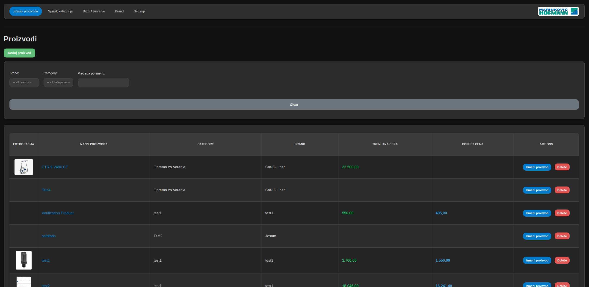
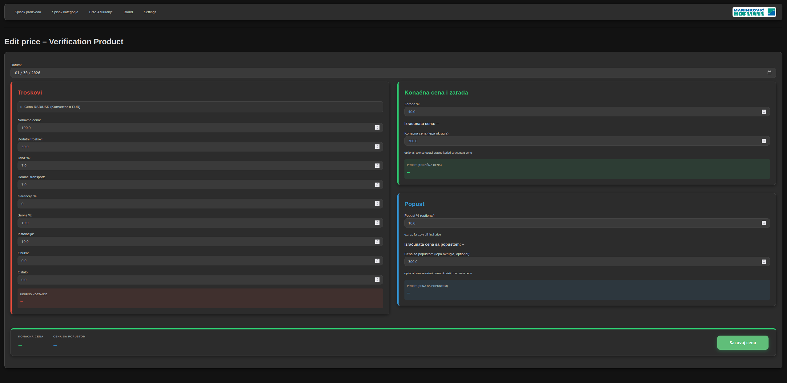
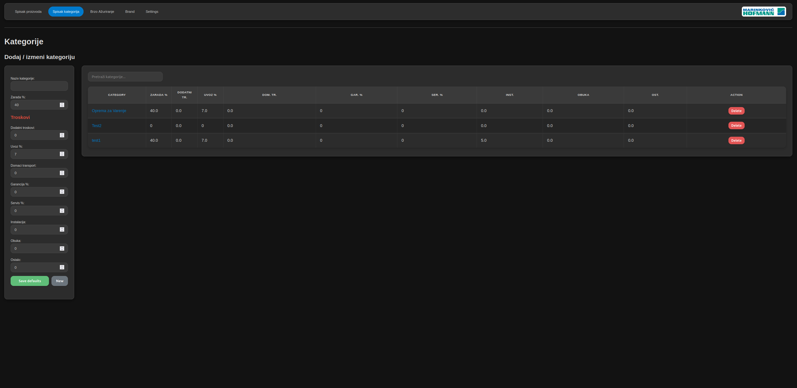
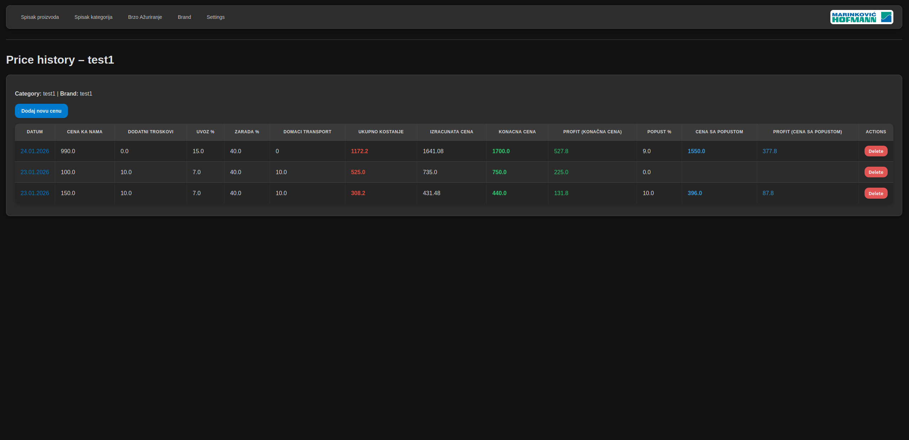
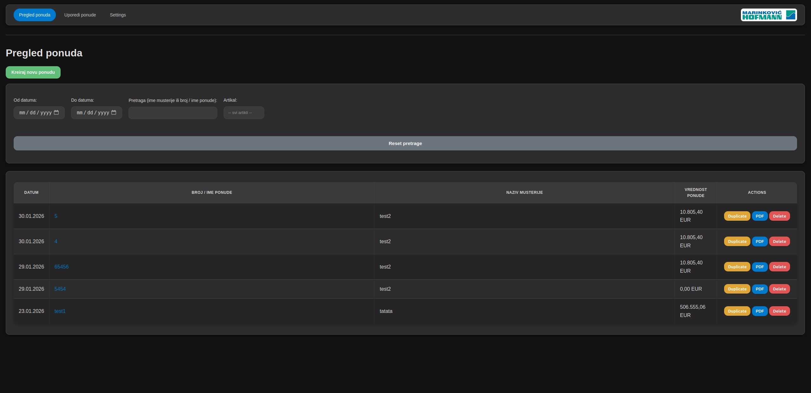
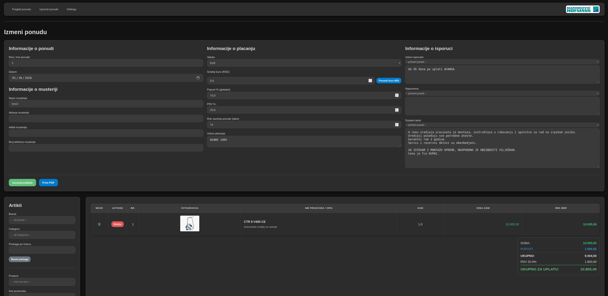
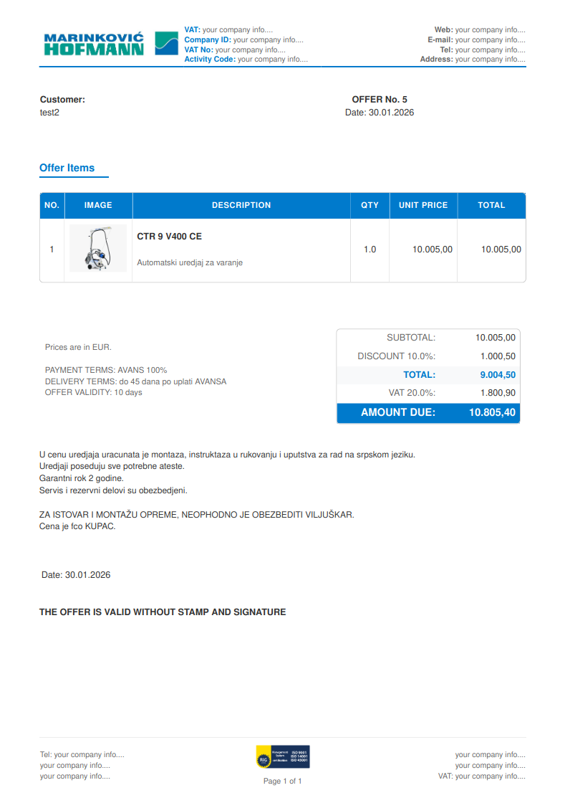
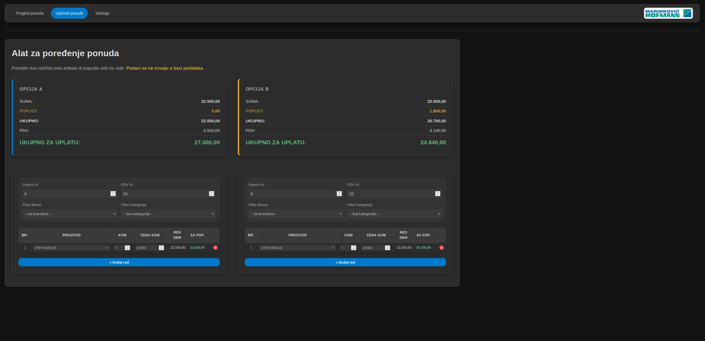
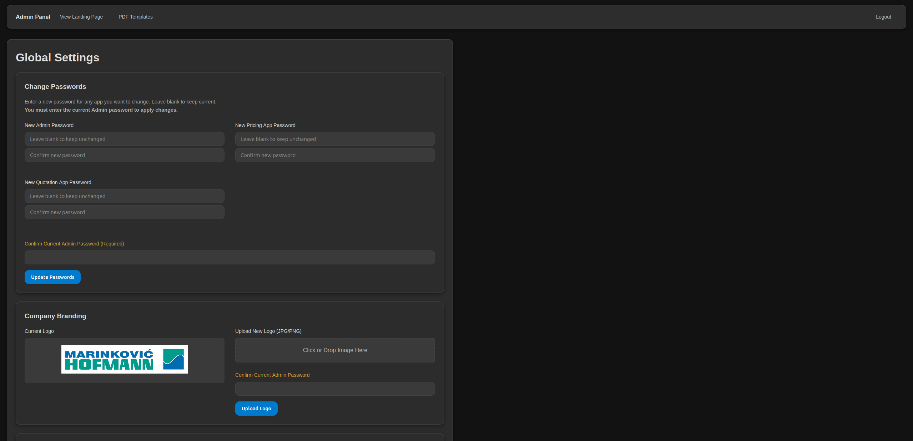
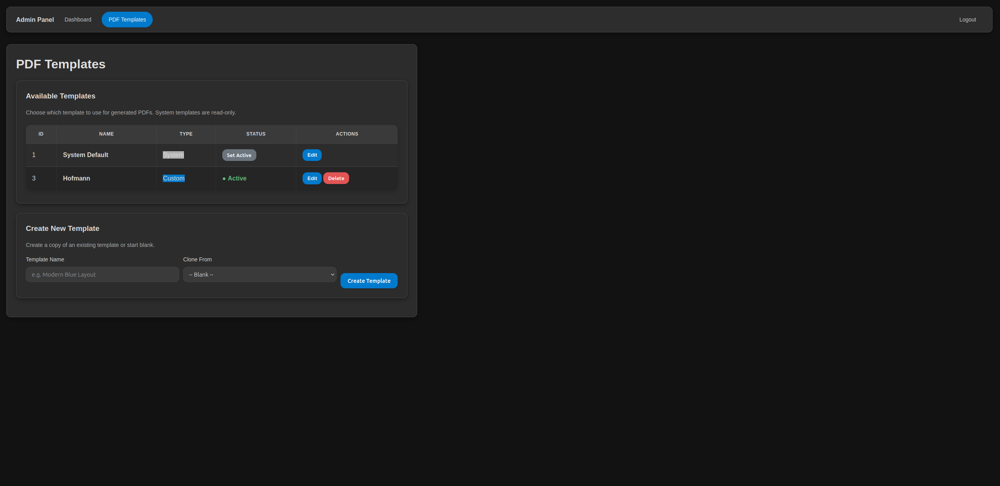

# CustomCRM 🚀

A CRM system for **Product Pricing** and **Quotation Management**.
Built for small teams and individuals.\
Easy to use and customize.\
80% vibe code, 20% traditional code.\
I am a beginner so security is non-existent. **Only use in local network!**

App is in extra early development!\
Please open issues for any bugs or suggestions!


## 🌟 Key Features

A lot of options to create price calculations.\
Easy to add photos to products.\
**Open source, free to use and modify as you wish. Fully local.**

### 🏷️ Pricing App
Manage your product catalog with precision. Calculate margins, track base costs, and visualize profit with color-coded alerts.
- **Dynamic Calculation**: Automatic rounding and margin-based pricing.
- **Price History**: Keep track of every price change over time.

#### ➕ Add New Products and Edit
Seamlessly add products.

Easy price calculation and editing.

Presets from category and brand.

View price history.


### 📄 Quotation App
Transform prices into professional PDF offers for your clients in seconds.
- **Photo Integration**: Include product images directly in your offers.
- **NBS Exchange Rates**: Automatic real-time fetching of official rates.
- **Professional PDFs**: Clean, template ready for you and easy to edit in app.



#### ✏️ Edit Quotations
Powerful editor for adjusting offer details, adding items, and managing client info.\
Option to edit price and product name, description from quotation app.


#### 📝 PDF Output
Generate clean, brand-compliant PDFs.


#### 📝 Compare Prices
Compare prices of products or different quotations with different options and products.



### ⚙️ Admin Panel
Full control over your system's global settings and security.
- **Security Management**: Fast and easy password updates for all modules.
- **Branding**: Customize your company logo and PDF templates.
- **Default settings**: Set default settings for all modules like currency, date format, theme, etc.



#### ✏️ Edit and create PDF Templates
Create and edit PDF templates for your quotations.\
Needs knowledge of HTML and CSS. But it is easy to learn.\
Test PDF template in app, no need to restart.



---

## 🚀 Beginner's Quick Start

Setting up **CustomCRM** is easy, even for beginners!

### 💻 Fast Installation (Linux/Ubuntu) Linux only for now.
1. **Download and extract** the project folder.
2. **Open your terminal** in the project folder.
3. **Run the setup script**:
```
   ./run_apps.sh
```
   *This script will automatically install everything you need and start the application.*

4. **Access the app**:
   Open your browser and go to: `http://localhost:5000`

### 🔄 How to Update
To get the latest version with new features and fixes:
1. Open your terminal in the project folder.
2. Run:
```
   ./run_apps.sh
```
   *The script will pull the latest code and update your installation automatically.*

---

## 🔑 Default Credentials

Use these passwords to log in for the first time:

- **Admin Panel**: `admin1` (change all passwords from admin panel)
- **Pricing App**: `Price1`
- **Quotation App**: `Quotation1`

---

## 🗺️ Roadmap & Timeline

App is in extra early development!\
Please open issues for any bugs or suggestions!

Updates come based on [Timeline](https://github.com/users/lakisan1/projects/1).

2 big milestones will be:
- 🌍 **Multi-language Support**: Translation to multiple languages is coming soon.
- 🐳 **Docker Version**: A containerized version for even easier deployment is planned.

---
