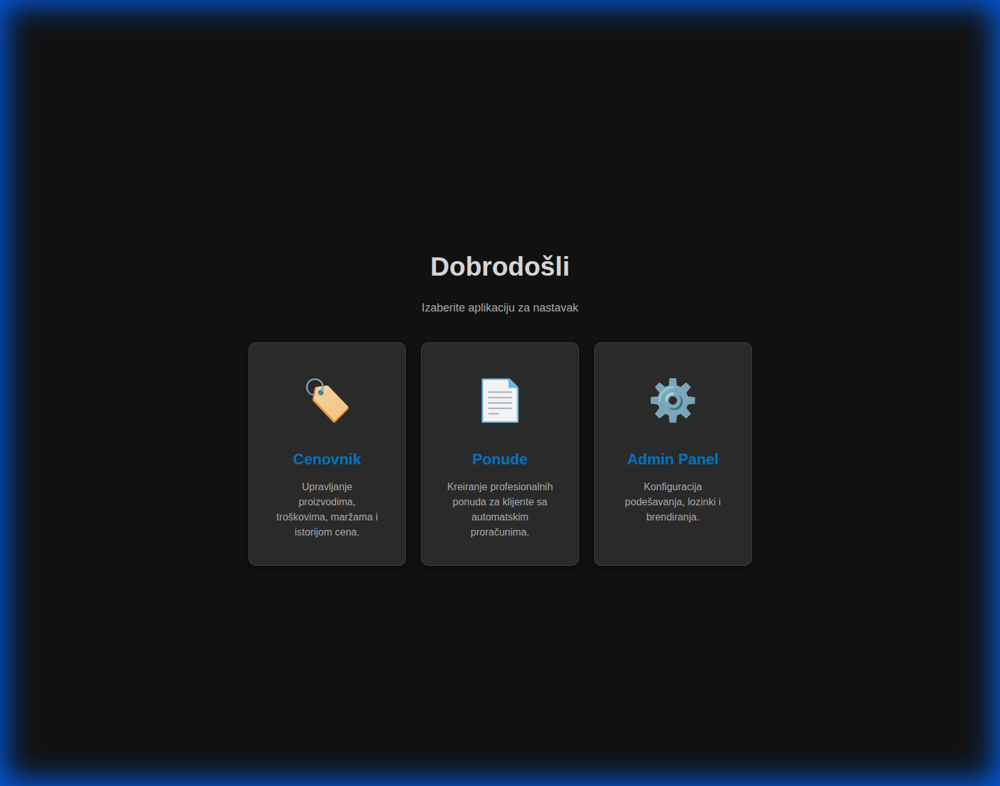
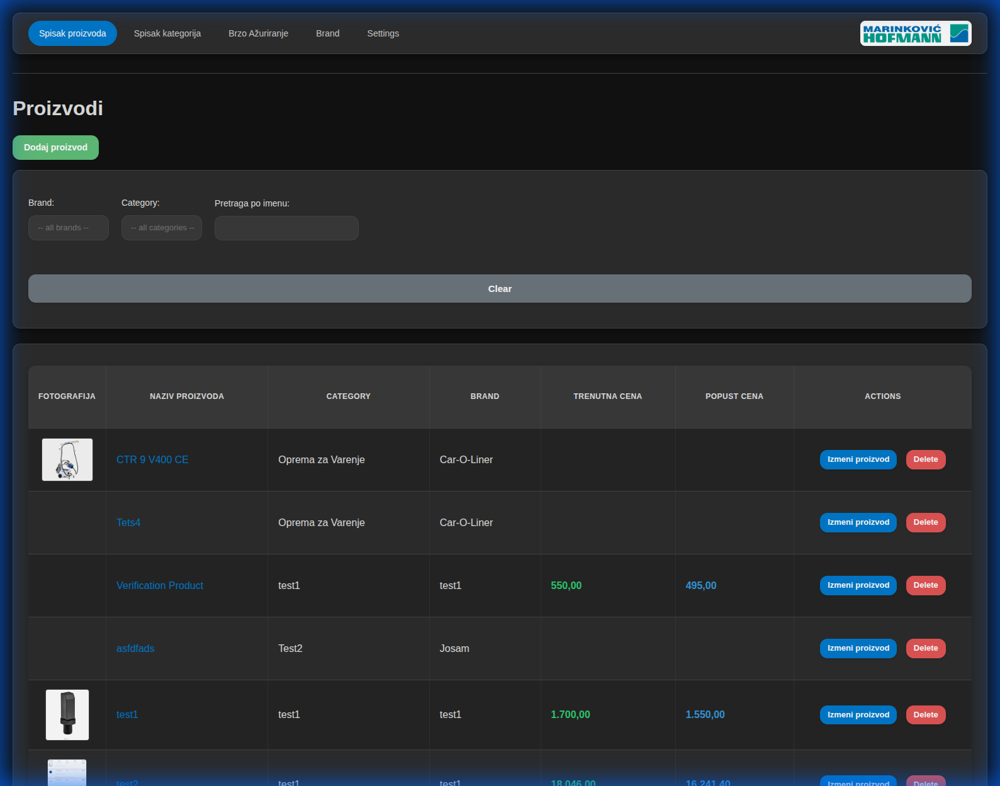
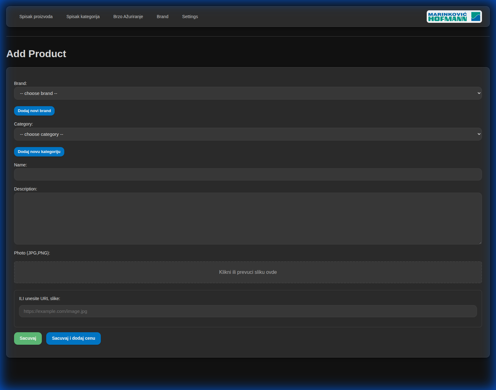
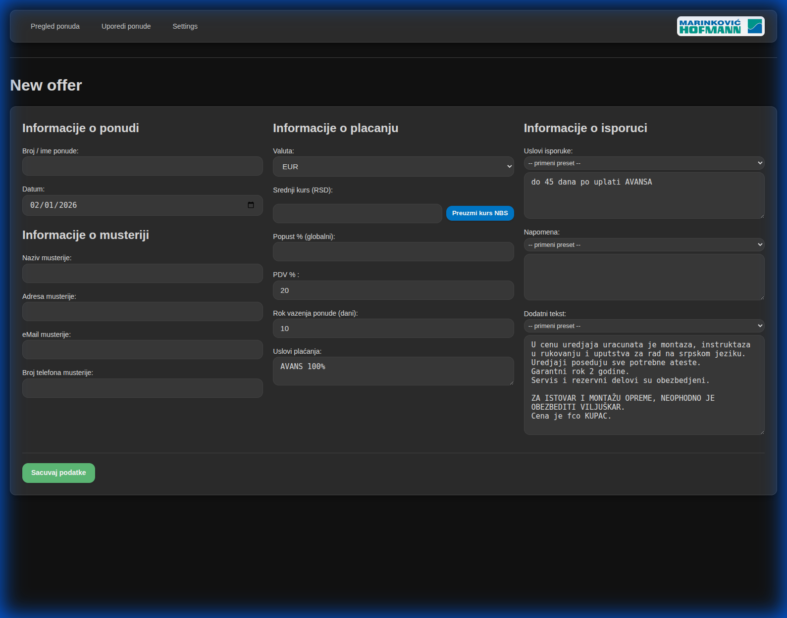
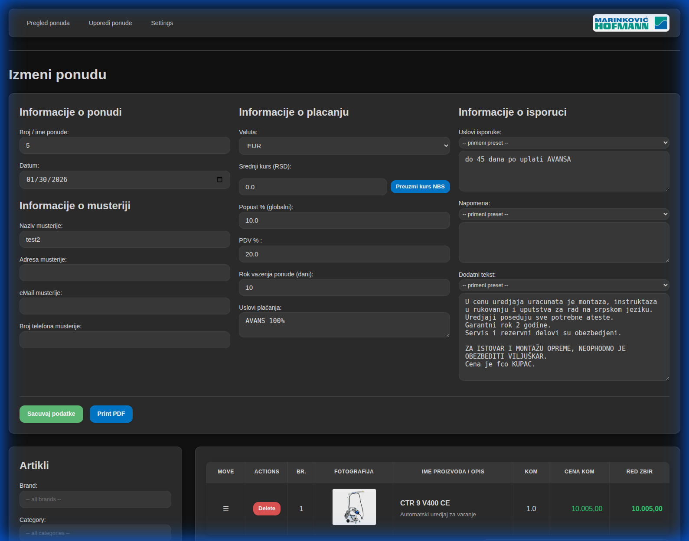
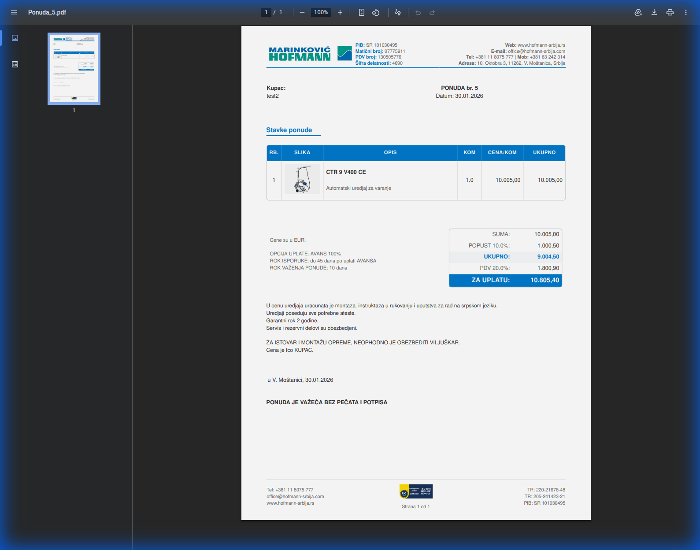
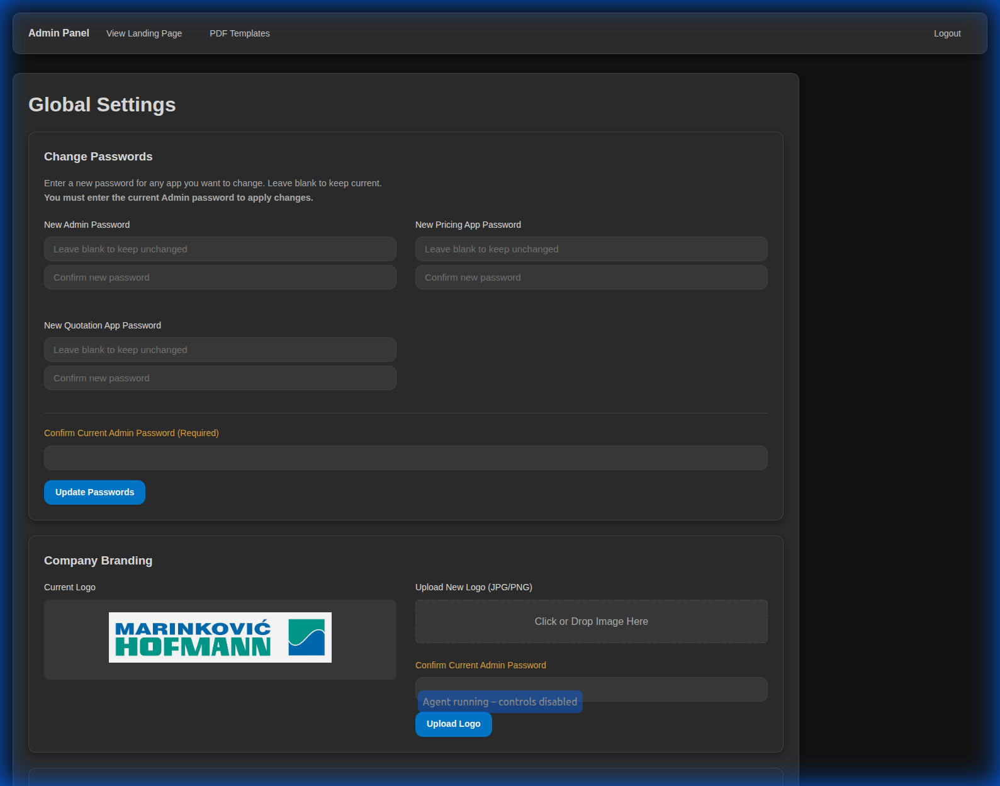

# CustomCRM 🚀

A professional, unified CRM system for **Product Pricing** and **Quotation Management**. Built for speed, portability, and visual clarity, especially with its unique photo support in quotations.



## 🌟 Key Features

### 🏷️ Pricing App
Manage your product catalog with precision. Calculate margins, track base costs, and visualize profit with color-coded alerts.
- **Dynamic Calculation**: Automatic rounding and margin-based pricing.
- **Price History**: Keep track of every price change over time.
- **Unified Aesthetics**: Premium dark-mode interface.



#### ➕ Add New Products
Seamlessly add products with category defaults and brand assignments.


### 📄 Quotation App
Transform prices into professional PDF offers for your clients in seconds.
- **Photo Integration**: Include high-quality product images directly in your offers.
- **NBS Exchange Rates**: Automatic real-time fetching of official RSD/EUR rates.
- **Professional PDFs**: Clean, modern templates ready for your clients.



#### ✏️ Edit Quotations
Powerful editor for adjusting offer details, adding items, and managing client info.


#### 📝 Professional PDF Output
Generate clean, brand-compliant PDFs for your clients instantly.


### ⚙️ Admin Panel
Full control over your system's global settings and security.
- **Security Management**: Fast and easy password updates for all modules.
- **Branding**: Customize your company logo and PDF templates.



---

## 🚀 Beginner's Quick Start

Setting up **CustomCRM** is easy, even for beginners!

### 💻 Fast Installation (Linux/Ubuntu)

1. **Open your terminal** in the project folder.
2. **Run the setup script**:
   ```bash
   ./run_apps.sh
   ```
   *This script will automatically install everything you need, set up a virtual environment, and start the application.*

3. **Access the app**:
   Open your browser and go to: `http://localhost:5000`

### 🔄 How to Update
To get the latest version with new features and fixes:
1. Open your terminal in the project folder.
2. Run:
   ```bash
   ./run_apps.sh
   ```
   *The script will pull the latest code and update your installation automatically.*

---

## 🔑 Default Credentials

Use these passwords to log in for the first time:

- **Admin Panel**: `admin1`
- **Pricing App**: `Price1`
- **Quotation App**: `Ponude1`

---

## 🗺️ Roadmap & Timeline

We are constantly improving! Based on our **Timeline Project**, here is what's coming:

- 🌍 **Multi-language Support**: Translation to multiple languages is coming soon.
- 🐳 **Docker Version**: A containerized version for even easier deployment is planned.
- 📱 **Mobile Optimization**: Further refinements for tablet and mobile use.

---

*CustomCRM - Simplify your business workflow.*
