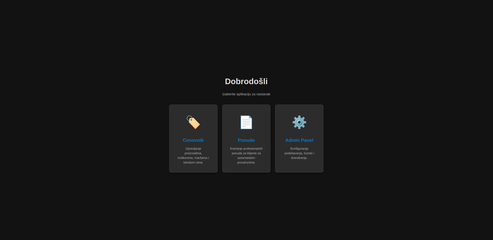
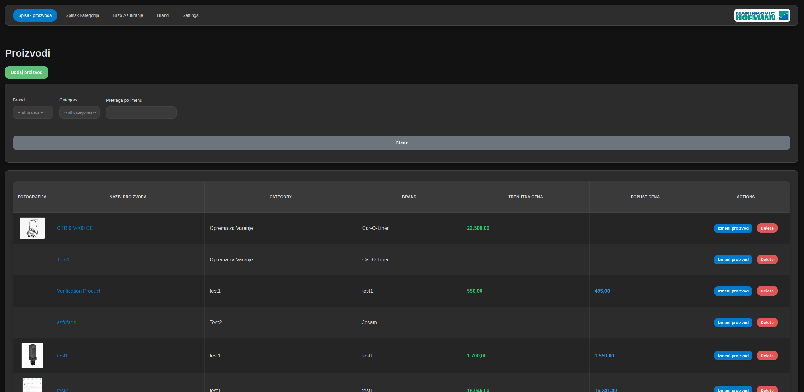
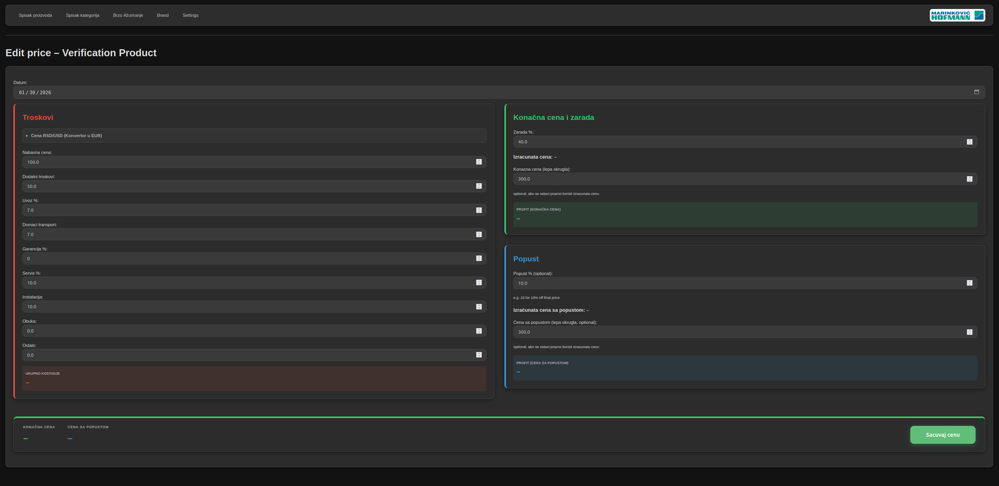

# QP-CRM (Quotation-Price CRM) 🚀

**QP-CRM** stands for **Quotation-Price CRM**. It's a specialized system designed to manage the critical link between product pricing, client offers, and equipment rental contracts.

Built for small teams and individuals.\
Easy to use and customize.\
80% vibe code, 20% traditional code.\
I am a beginner so security is non-existent. **Only use in local network!**

App is in extra early development!\
Please open issues for any bugs or suggestions!



## 📚 Guides (uputstva)

| Guide | Šta pokriva |
|---|---|
| **[📦 Instalacija](INSTALL.md)** | Prva instalacija sa Docker-om — skine gotov image sa GitHub-a i startuje (bez build-a, 3 koraka) |
| **[🔄 Update](UPDATE.md)** | Update na novu verziju — jedna komanda (`./deploy.sh`), automatski backup, rollback; ili potpuno automatski (Watchtower) |
| **[🐳 Docker operacije](DOCKER.md)** | Volumes, logs, backup, nginx/HTTPS, test suite |
| **[🔌 API](README_API.md)** | REST API — auth (per-user API keys), endpoints |

## 🌟 Key Features

For a comprehensive list of all application features, check out the [Full Feature List](FEATURES.md).

A lot of options to create a custom sale price based on a lot of parameters.\
Easy to add photos to products.\
**Open source, free to use and modify as you wish. Fully local.**

### 🏷️ Pricing App
Manage your product catalog with precision. Calculate margins, track base costs, and visualize profit with color-coded alerts.
- **Dynamic Calculation**: Automatic rounding and margin-based pricing.
- **Price History**: Keep track of every price change over time.
- **Quick Price Update**: Update prices for multiple products on one page.
- **Bulk Import/Export**: Import and Export your database with ease.
- **Price Comparison**: Compare prices of products or different offers.
- **Filters**: Advanced filtering for products and offers.
- **Date Format**: Customizable date format settings.

#### ➕ Add and edit Products and Prices
Seamlessly add products.


Easy price calculation and editing.


Presets from category and brand.

### 📄 Offer App

### ⚙️ Admin Panel

### 📦 Rent Module

## 🚀 Quick Start

### 💻 Docker (recommended — Linux)

Najbrži start: skineš gotov image sa GitHub-a i startuješ. Bez build-a, bez git-a.

```bash
# 1. preuzmi docker-compose.yml i .env.example iz ovog repo-a u prazan folder
# 2. napravi .env od primera i popuni 6 tajni ključeva (uputstvo u fajlu)
cp .env.example .env
# 3. startuj
docker compose up -d
```

Detaljno uputstvo sa objašnjenjima: **[📦 INSTALL.md](INSTALL.md)**.

### 💻 Bare-metal (Linux/Ubuntu) — old way

1. **Download and extract** the project folder.
2. **Open your terminal** in the project folder.
3. **Run the setup script**:
```
   ./run_apps.sh
```
   *This script will automatically install everything you need and start the application.*

4. **Access the app**:
   Open your browser and go to: `http://localhost:5000`

### 📱 Using as a Chrome PWA (Recommended for Desktop)
For the best experience on your local network, we highly recommend installing the app as a **Chrome Progressive Web App (PWA)**. 

**Why use the PWA?**
- **Native feel**: It opens in its own window without browser tabs or an address bar distracting you.
- **Easy Access**: It gets its own icon on your desktop and taskbar.
- **Automatic Updates**: When the server updates, your app updates automatically on refresh, no need to reinstall!

**How to install the PWA:**
1. Open the app URL (e.g., `http://192.168.1.200:5000`) in **Google Chrome**.
2. At the very right side of the URL address bar. You will see a small icon that looks like a computer screen with a downward arrow.
3. Click it, name it what you like and select **Install**.
4. The app will immediately open in its own clean window!

#### ⚠️ Chrome PWA: Removing the "Not Secure" warning
Because PWAs usually require HTTPS, using a local IP might show a "Not secure" top bar. This bar can be annoying and requires more clicks when downloading PDFs and backups. To permanently remove it on your office computers:
1. Open Google Chrome on the client computer.
2. Copy and paste `chrome://flags/#unsafely-treat-insecure-origin-as-secure` into the address bar.
3. In the text box right below **"Insecure origins treated as secure"**, enter your app's exact local URL (including `http://`, e.g., `http://192.168.1.200:5000`).
4. Change the dropdown next to it from **Disabled** to **Enabled**.
5. Click the **Relaunch** button at the bottom right of Chrome.
6. Re-open your PWA. (If the warning still shows, uninstall the PWA and reinstall it from the browser).

### 🔄 How to Update

Docker deployment: **[🔄 UPDATE.md](UPDATE.md)** — ukratko:

```bash
./deploy.sh      # skine novi image + automatski backup baze + restart + healthcheck
./rollback.sh    # (samo ako treba) vrati na prethodnu verziju
```

Podaci (korisnici, šifre, ponude, ugovori, slike) su na disku van image-a —
update ih nikad ne gubi. Postoji i **potpuno automatski** update preko
Watchtower-a (podešavanje u UPDATE.md, fajl `watchtower-compose.example.yml`).

Bare-metal (`run_apps.sh`) users: run the script again — it pulls the latest
code and restarts.

---

## 🔑 Default Credentials

Use these passwords to log in for the first time:

- **Admin Panel**: `Admin1` (change all passwords from admin panel)
- **Pricing App**: `Price1`
- **Offer App**: `Offer1`
- **Rent Module**: `Rent1`

---

## 🗺️ Roadmap

App is in early development!\
Please open issues for any bugs or suggestions!

Updates come based on [Timeline](https://github.com/users/lakisan1/projects/1/views/3).

---
