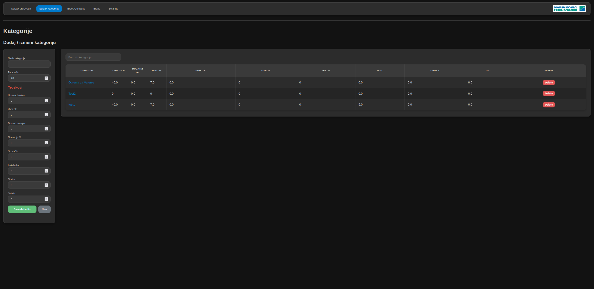
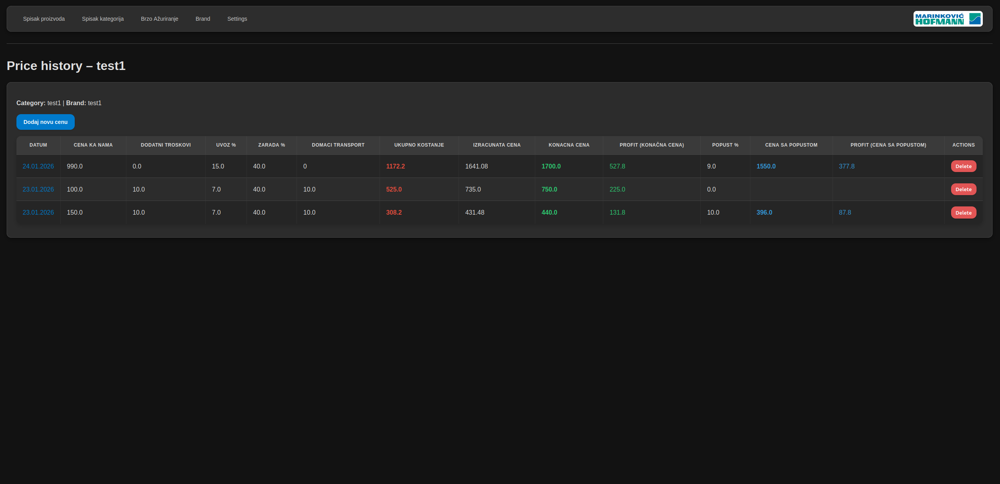
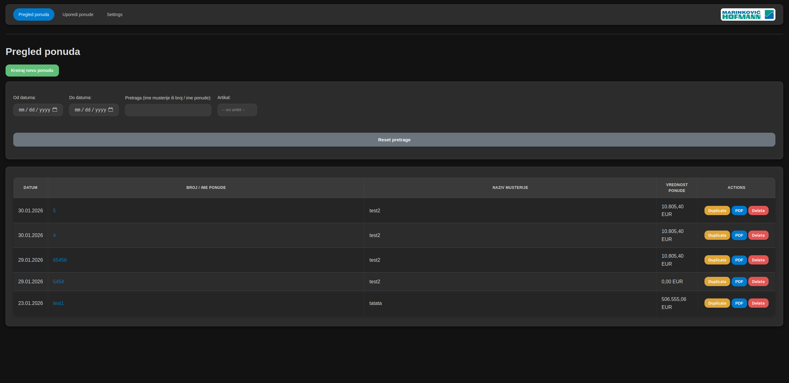
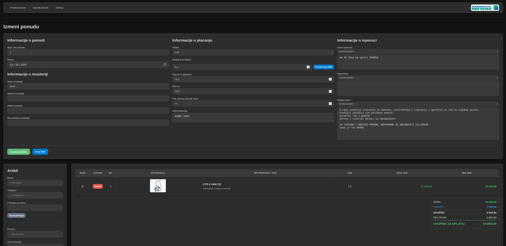
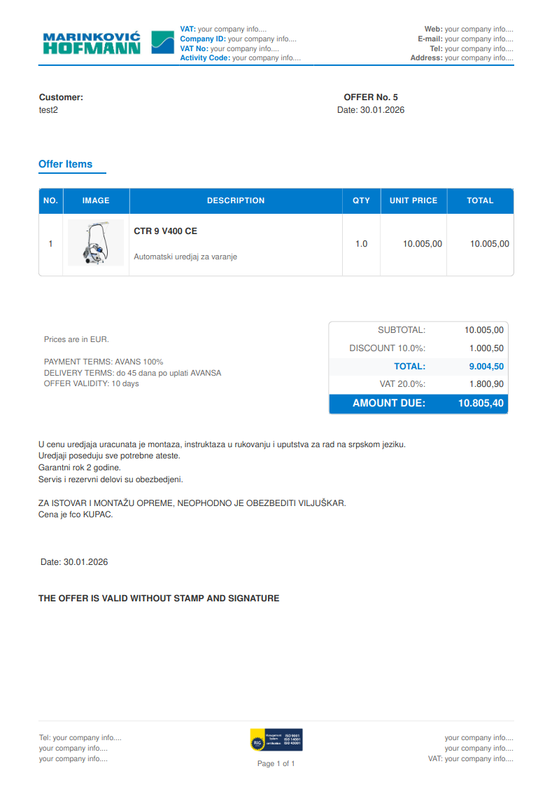
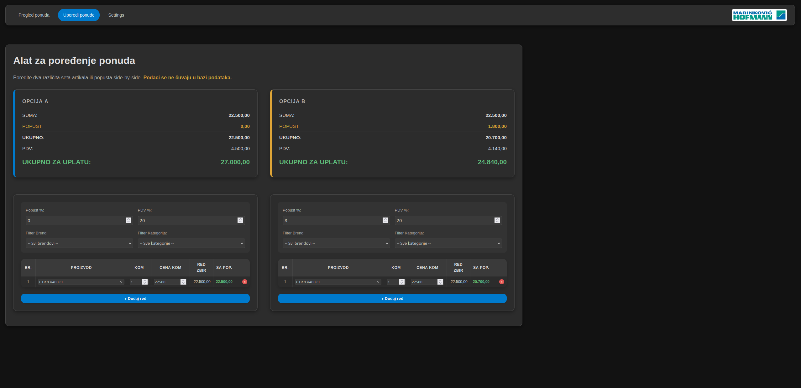
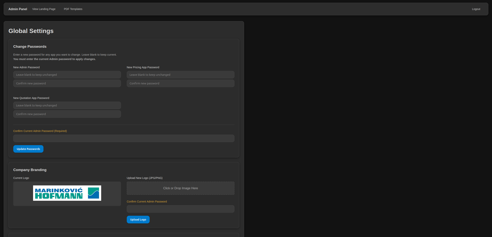
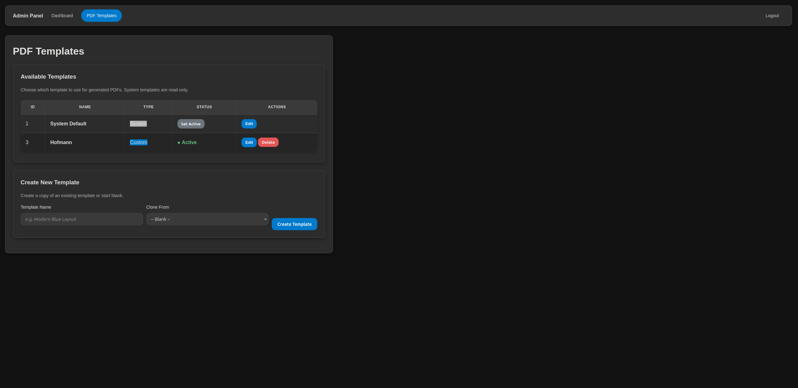

# QP-CRM (Quotation-Price CRM) 🚀

**QP-CRM** stands for **Quotation-Price CRM**. It's a specialized system designed to manage the critical link between product pricing, client offers, and equipment rental contracts.

Built for small teams and individuals.\
Easy to use and customize.\
80% vibe code, 20% traditional code.\
I am a beginner so security is non-existent. **Only use in local network!**

App is in extra early development!\
Please open issues for any bugs or suggestions!


## 🌟 Key Features

For a comprehensive list of all application features, check out the [Full Feature List](FEATURES.md).

A lot of options to create a custom sale price based on a lot of parameters.\
Easy to add photos to products.\
**Open source, free to use and modify as you wish. Fully local.**

### 🏷️ Pricing App
Manage your product catalog with precision. Calculate margins, track base costs, and visualize profit with color-coded alerts.
- **Dynamic Calculation**: Automatic rounding and margin-based pricing.
- **Price History**: Keep track of every price change over time.
- **Quick Price Update**: Update prices for multiple products on one page.
- **Bulk Import/Export**: Import and Export your database with ease.
- **Price Comparison**: Compare prices of products or different offers.
- **Filters**: Advanced filtering for products and offers.
- **Date Format**: Customizable date format settings.

#### ➕ Add and edit Products and Prices
Seamlessly add products.


Easy price calculation and editing.


Presets from category and brand.


View price history.


Quickly update prices by just typing the new input price and additional costs. Save and its added to price history.


### 📄 Offer App
Transform prices into professional PDF offers for your clients in seconds.
- **Photo Integration**: Include product images directly in your offers from URL or file.
- **NBS Exchange Rates**: Automatic real-time fetching of official rates.
- **Professional PDFs**: Clean, template ready for you and easy to edit in app.
- **Email Integration**: Send offers directly to clients from the app.
- **Per-line Discount**: Apply discounts to individual items in the offer.
- **Offer Presets**: Save and load offer templates for faster creation.
- **Customizable Fields**: Configure mandatory fields and default values.
- **Item Reordering**: Easily rearrange items in your offer.



#### ✏️ Edit Offers
Powerful editor for adjusting offer details, adding items, and managing client info.\
Option to edit price and product name, description from offer app.


#### 📝 PDF Output
Generate clean, brand-compliant PDFs.


#### 📝 Compare Prices
Compare prices of products or different offers with different options and products.



### ⚙️ Admin Panel
Full control over your system's global settings and security.
- **User Management**: One login for the whole app. Create accounts and manage every password from **Admin → Users** — `staff` accounts get per-module access (pricing / offer / rent / sale), `admin` accounts open everything.
- **Branding**: Customize your company logo and PDF templates.
- **Default settings**: Set default settings for all modules like currency, date format, theme, etc.
- **Text Presets**: Manage default text for delivery terms, notes, and more.
- **Unified UI**: Consistent and modern user interface across all apps.
- **Database Management**: Import and export your database for backup or migration.



#### ✏️ Edit and create PDF Templates
Create PDF templates for your offers.\


Knowledge of HTML and CSS required. But it is easy to learn.\
Test custom PDF templates in app, no need to restart.


### 📦 Rent Module
Manage equipment rental contracts with full document generation and financial calculations.
- **Contract Management**: Create and track rental contracts with client details, equipment lists, and payment schedules.
- **Financial Calculator**: Built-in lease calculator with interest rates, insurance, guarantees, VAT, and salvage value.
- **Document Templates**: 8+ editable legal document templates (contracts, appendices, protocols) with live HTML editor.
- **PDF Generation**: Professional PDF output with company branding, page break protection, and automatic placeholder substitution.
- **Payment Schedules**: Auto-generated amortization plans with monthly breakdowns.
- **Email Preset**: Customizable email template with subject line, auto-filled client data, and one-click copy for each field.
- **Offer Integration**: Prilog 3 (Offer) and Prilog 4 (Payment Plan) auto-linked from the contract documents page.
- **Admin Configuration**: Centralized default rates, template editing, and email preset management from the Admin panel.


---

## 🚀 Beginner's Quick Start

Setting up **QP-CRM** is easy, even for beginners!

### 💻 Fast Installation (Linux/Ubuntu) Linux only for now.
1. **Download and extract** the project folder.
2. **Open your terminal** in the project folder.
3. **Run the setup script**:
```
   ./run_apps.sh
```
   *This script will automatically install everything you need and start the application.*

4. **Access the app**:
   Open your browser and go to: `http://localhost:5000`

### 📱 Using as a Chrome PWA (Recommended for Desktop)
For the best experience on your local network, we highly recommend installing the app as a **Chrome Progressive Web App (PWA)**. 

**Why use the PWA?**
- **Native feel**: It opens in its own window without browser tabs or an address bar distracting you.
- **Easy Access**: It gets its own icon on your desktop and taskbar.
- **Automatic Updates**: When the server updates, your app updates automatically on refresh, no need to reinstall!

**How to install the PWA:**
1. Open the app URL (e.g., `http://192.168.1.200:5000`) in **Google Chrome**.
2. At the very right side of the URL address bar. You will see a small icon that looks like a computer screen with a downward arrow.
3. Click it, name it what you like and select **Install**.
4. The app will immediately open in its own clean window!

#### ⚠️ Chrome PWA: Removing the "Not Secure" warning
Because PWAs usually require HTTPS, using a local IP might show a "Not secure" top bar. This bar can be annoying and requires more clicks when downloading PDFs and backups. To permanently remove it on your office computers:
1. Open Google Chrome on the client computer.
2. Copy and paste `chrome://flags/#unsafely-treat-insecure-origin-as-secure` into the address bar.
3. In the text box right below **"Insecure origins treated as secure"**, enter your app's exact local URL (including `http://`, e.g., `http://192.168.1.200:5000`).
4. Change the dropdown next to it from **Disabled** to **Enabled**.
5. Click the **Relaunch** button at the bottom right of Chrome.
6. Re-open your PWA. (If the warning still shows, uninstall the PWA and reinstall it from the browser).

### 🔄 How to Update
To get the latest version with new features and fixes:
1. Open your terminal in the project folder on the server.
2. Run:
```
   ./run_apps.sh
```
   *The script will pull the latest code and update your installation automatically.*

---

## 🔑 First Login & Accounts

The whole app uses **one login** — there are no separate logins for the Admin,
Pricing, Offer or Rent apps anymore. Open `http://<server-ip>:5000/login`
(any module link sends you there and returns you to the page you wanted after
login).

- **On a fresh install only one account exists: `admin`**, with the default
  password **`Admin1`**. (If the legacy `admin_password` setting is present
  in your database, that value is used instead of the default.) Log in and
  **rotate this password immediately**.
- **Create staff accounts in Admin → Users.** Every account has a role:
  `admin` opens every module; `staff` opens only the modules granted to it
  via the pricing / offer / rent / sale checkboxes on the user's row. Admins
  bypass the checkboxes.
- **All password changes happen in Admin → Users** — there is no self-service
  "change my password" page. The admin sets a user's password from the user's
  row (including your own row) and confirms the save with the current admin
  password.
- **Log out from the Settings page** (`/settings`) — the app headers carry no
  logout button; the Settings page hosts the app's single logout control,
  routed through the unified `/logout`.
- **Sessions last 8 hours (sliding)** — the clock restarts on activity, so an
  idle browser is logged out after 8 hours.

---

## 🗺️ Roadmap

App is in early development!\
Please open issues for any bugs or suggestions!

Updates come based on [Timeline](https://github.com/users/lakisan1/projects/1/views/3).

---
